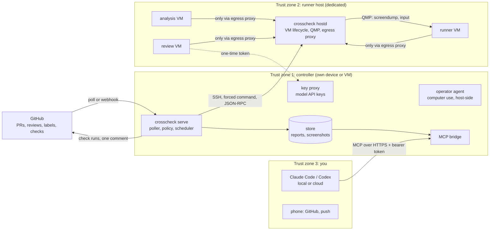

# 02 Architecture

## Overview

There are two processes that matter:

- **`crosscheck serve`** on the controller. It is the only thing that holds secrets.
- **`crosscheck hostd`** on the runner host. It creates, drives and destroys VMs and holds no
  secrets at all. On a single machine it runs in-process.

## Components

### Controller (`crosscheck serve`)

- **GitHub integration.** Polls GitHub every minute (no inbound port needed) or receives
  webhooks. Works as a GitHub App (preferred, enables Check Runs) or with a fine-grained token
  (commit statuses and one comment). Minimal permissions: `contents:read`,
  `pull_requests:write`, `checks:write`, `metadata:read`.
- **Policy engine.** Decides per PR head SHA which stage runs, on which platforms and presets,
  with which budget. Reads the admin policy from the controller and `crosscheck.yaml` only from
  the PR's **base** commit. Determines the author's trust class live through the API.
- **Scheduler.** Queue, per-host concurrency, timeouts, cancel-on-new-push, monthly model budget.
- **Source handling.** Downloads the tarball for the exact head SHA through the GitHub API and
  passes it **unopened** to the runner host. No `git clone` on trusted machines.
- **Operator agent.** Drives the GUI through screenshots and input events only. It runs on the
  controller, outside every VM. See [13 Agents](13-agents-and-benchmarks.md).
- **Key proxy.** Holds model API keys. VMs that need a model (review agents) get a one-time,
  budget-capped token instead of a key.
- **Report builder.** Builds the report from host-side facts, validates it against
  [`schemas/report.schema.json`](../schemas/report.schema.json), stores it.
- **MCP bridge.** Serves runs, findings and artifacts to chat sessions. See
  [06 Chat bridge](06-chat-bridge.md).

### Runner host (`crosscheck hostd`)

- **Backends.** `qemu` (plain Linux with KVM, unprivileged), `proxmox` (drives `qm` locally),
  and `fake` (tests). The controller talks to hostd over SSH with a forced command
  (`command="crosscheck hostd --stdio"`), so the runner host needs no extra open port and the
  controller key can do nothing else.
- **VM control via QMP.** hostd adds its own QMP socket to every VM. `screendump` gives PNG
  screenshots, `input-send-event` sends absolute mouse and keyboard events through
  `virtio-tablet` and `virtio-keyboard`. There is no USB controller, no guest agent and no
  clipboard channel.
- **Job in, results out.** The job (manifest plus source tarball) goes in as a read-only ISO.
  Results come back on a small raw disk that the guest writes a single size-limited archive to.
  hostd never mounts it. The controller parses it in a resource-limited subprocess and accepts
  only whitelisted files.
- **Egress proxy.** A per-run allow-list proxy. VMs get no DNS and no route anywhere else.
  Every attempt, allowed or denied, is logged and becomes part of the report.
- **Throttling.** Cores, CPU time limit, CPU model and flags, memory, disk bandwidth and IOPS,
  display size and scale, network shaping. See [09 Hardware profiles](09-hardware-profiles.md).
- **Janitor.** Destroys every resource whose expiry has passed, also without the controller and
  after a power loss.

### Guest images

One golden image per platform, built reproducibly (`crosscheck images build`). Each image
contains an auto-login desktop, the guest runner, and the toolchains for common profiles. See
[05 Platform matrix](05-platform-matrix.md).

## Data flow of one run

1. The poller sees a new head SHA on an open PR.
2. The policy engine determines the trust class, checks the admin policy and the approval on the
   exact SHA, and decides the scope. See [11 Admin](11-admin-and-trust-policies.md).
3. Cheap host-side checks run on metadata only: config change detection, injection patterns in
   title, body and commit messages.
4. The source tarball is fetched for the pinned SHA.
5. For each platform and preset, hostd creates a disposable VM from the template, attaches the
   job ISO and results disk, applies the preset, and starts it.
6. The guest runner builds the app and starts it. The host watches the framebuffer.
7. The operator agent works through the smoke scenario. The host measures timings.
8. hostd stops the VM, reads the results disk, collects the egress log, and destroys everything.
   A deletion receipt is returned.
9. Optionally, stage 2 (deep review) runs in a review VM.
10. The controller builds and validates the report, updates the check, and edits its single PR
    comment.
11. Registered webhooks (for example a Claude Code cloud session) are notified.

## Deployment variants

| Variant | Controller | Runner host | Notes |
|---------|------------|-------------|-------|
| Two devices (recommended) | Mini PC, Raspberry Pi 5, small cloud VM | Dedicated Linux or Proxmox box in its own VLAN | A VM escape finds no secrets |
| Single machine | Same machine, separate user | Same machine | Simplest. The admin view shows a yellow safety light for untrusted PRs |
| Cloud burst | Anywhere | Short-lived cloud instances per run | For hardware you do not own. See [14](14-simulating-hardware-you-dont-have.md) |
