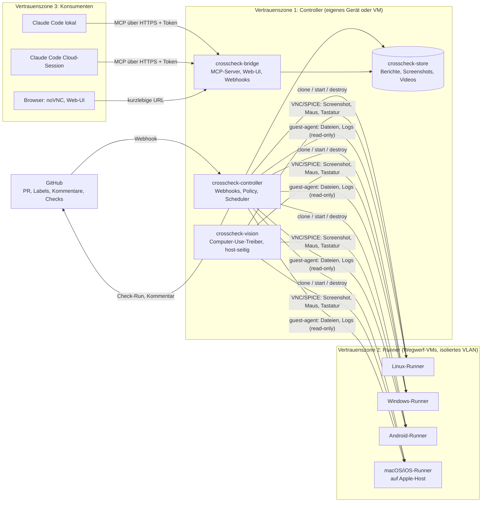

# 02 Architektur

## Überblick

Vier Komponenten laufen im vertrauenswürdigen Bereich, die Runner sind Wegwerfware.

## Komponenten

### crosscheck-controller

Der einzige Teil, der Geheimnisse besitzt. Läuft empfohlen auf einem **eigenen Gerät**
(Mini-PC, Raspberry Pi 5, kleine Cloud-VM), getrennt vom Runner-Host. Auf einem
Einzelrechner läuft er als VM auf demselben Proxmox; die Admin-Oberfläche zeigt das als
gelbe Ampel. Begründung und Härtung stehen in [12 Isolation](12-isolation-und-loeschung.md).
Aufgaben:

- **GitHub-App.** Empfängt Webhooks (`pull_request`, `issue_comment`, `pull_request_review`),
  schreibt Check-Runs und Kommentare. Berechtigungen minimal: `contents:read`,
  `pull_requests:write`, `checks:write`, `metadata:read`.
- **Policy-Engine.** Entscheidet pro Ereignis, welche Stufe läuft, auf welchen Plattformen,
  mit welchem Budget. Liest die Konfiguration `crosscheck.yaml` ausschließlich vom
  **Basis-Branch** des PRs (siehe Sicherheitsmodell).
- **Scheduler.** Verwaltet eine Warteschlange, Parallelitätslimits pro Host, Timeouts und
  das monatliche Modell-Budget pro Repo. Wählt die Preset-Matrix pro Lauf und rechnet
  Presets über die Host-Kalibrierung in konkrete VM-Parameter um.
- **Throttling.** Setzt `cores`, `cpulimit`, CPU-Typ und -Flags, Platten-Limits und
  Balloon-Größe über die Proxmox-API, Netzprofile per `tc netem` auf dem Tap-Interface
  des Hosts. Zeitabhängige Profile (Hitze, Wackelnetz, RAM-Druck) werden während des
  Laufs nachgeführt.
- **Runner-Lifecycle.** Spricht die Proxmox-API (`/api2/json`): Linked Clone vom Template,
  Cloud-Init oder Sysprep-Parameter setzen, Start, nach dem Lauf `destroy`. Für den Apple-Host
  spricht er eine kleine Agent-API (Tart/UTM) statt Proxmox.
- **Artefakt-Transfer.** Holt den PR-Stand per GitHub-Tarball-API für einen festen SHA und
  reicht ihn **ungeöffnet** zusammen mit dem Build-Auftrag als einmaliges ISO in die VM.
  Kein `git clone` auf vertrauenswürdigen Systemen. Holt Logs und Build-Artefakte per
  QEMU-Guest-Agent (`guest-file-read`) zurück. Es gibt keine Netzwerkverbindung Runner → Controller.
- **Analyse.** Lässt Stufe 0 (Secret-Scan, SAST, Dependency-Audit) in einer eigenen
  Analyse-VM laufen, weil auch Scanner feindliche Dateien parsen. Rückgaben aus VMs
  parst eine Auswertungs-VM, der Controller sieht nur schema-geprüftes JSON. Er ruft für Stufe 2 das Modell auf, baut den Bericht nach Schema.

### crosscheck-vision

Der Computer-Use-Treiber. Läuft **host-seitig** im Controller, nicht in der VM. Er sieht die
VM nur durch den Bildschirm (VNC/SPICE-Framebuffer) und bedient sie nur über Maus- und
Tastatur-Events. Das ist bewusst: kein Agent in der VM bedeutet, dass PR-Code keinen
Prozess mit Modellzugang finden kann.

- Werkzeuge, die dem Modell zur Verfügung stehen: `screenshot`, `click`, `double_click`,
  `right_click`, `drag`, `type`, `key`, `scroll`, `wait`. Nichts anderes. Kein Shell-Zugriff,
  kein Dateizugriff, kein Netzwerk.
- Der Prüfplan (das Smoke-Szenario) kommt aus `crosscheck.yaml` des Basis-Branches und wird
  als Anweisung übergeben. Alles, was auf dem Bildschirm steht, ist Beobachtung.
- Jeder Schritt wird protokolliert: Screenshot vorher, Aktion, Screenshot nachher. Daraus
  entsteht das Video und die Schritt-Liste im Bericht.
- Stop-Regeln: maximale Schrittzahl, maximale Laufzeit, Abbruch bei erkannter Crash-Meldung
  oder wenn der Bildschirm über N Schritte unverändert bleibt.

### crosscheck-runner (Templates)

Pro Plattform ein Golden Image, gebaut mit Packer und Ansible, in Proxmox als Template
abgelegt. Details in [05 Plattform-Matrix](05-plattform-matrix.md). Eigenschaften:

- Kein Netzwerk außer zum Paket-Proxy (Allow-List). Standard: Egress verweigert, geloggt.
- QEMU-Guest-Agent installiert, für Dateitransfer und sauberes Herunterfahren.
- Auto-Login in eine Desktop-Session. Auflösung, Skalierung, Kerne, Takt, RAM, Platte,
  Grafik und Netz setzt der Controller pro Lauf aus dem Hardware-Preset
  (siehe [09 Hardware-Profile](09-hardware-profile.md)). Innerhalb eines Presets sind sie
  fest, damit Screenshots reproduzierbar sind.
- Ein Build-Runner-Skript, das den Auftrag vom Einmal-ISO liest, baut, die App startet und
  eine Statusdatei schreibt. Es hat keine Zugangsdaten und ruft nichts von außen ab.
- Alle Dateisystem- und Netzwerkzugriffe der App werden mitgeschnitten (auditd/ETW/Sysmon,
  nftables-Log oder Windows-Firewall-Log) und zurückgeholt.

### crosscheck-store

Ablage für Berichte (JSON nach Schema), Screenshots (PNG), Videos (WebM), Logs (redigiert).
Im MVP ein Verzeichnisbaum plus SQLite-Index, später optional MinIO/S3. Jedes Artefakt hat
eine ID, unter der die Bridge es ausliefert.

### crosscheck-bridge

Die Schnittstelle nach außen. Details in [06 Chat-Bridge](06-chat-bridge.md).

- **MCP-Server** über HTTPS mit Bearer-Token. Liefert Runs, Berichte, Findings, Artefakte.
- **Webhook-Ausgang.** Sessions können sich für einen Run registrieren und werden beim
  Abschluss geweckt (kompatibel mit Claude Code Cloud `watch_url`).
- **Web-UI.** Minimal: Run-Liste, Bericht, Screenshots, Video, und ein kurzlebiger
  noVNC-Link auf eine VM im Zustand `hold`.
- **Interaktiver Modus.** Solange eine VM im `hold` ist, kann die Bridge Computer-Use-Aktionen
  aus einer Chat-Session an `crosscheck-vision` weiterreichen, mit derselben Allow-List.

## Datenfluss eines Laufs

1. GitHub sendet `pull_request.synchronize` an den Controller.
2. Policy-Engine lädt `crosscheck.yaml` vom Basis-Branch, bestimmt die Vertrauensklasse
   live über die GitHub-API, prüft Richtlinie aus der Admin-Oberfläche, Labels, Approve am
   exakten SHA und Budget (siehe [11](11-admin-und-vertrauensrichtlinien.md)).
3. Stufe 0 läuft in einer Wegwerf-Analyse-VM ohne Secrets und ohne Netz. Ergebnis geht als erster Check-Run an GitHub.
4. Für jede konfigurierte Plattform: Linked Clone, Auftrag einspielen, VM starten.
5. Build-Runner in der VM baut und startet die App, schreibt `status.json`.
6. `crosscheck-vision` fährt das Smoke-Szenario, sammelt Screenshots und Schritte.
7. Controller holt Logs, Audit-Mitschnitte und `status.json` per Guest-Agent, redigiert sie.
8. Falls angefordert: Stufe 2 mit Modellaufruf über Diff plus Beobachtungen.
9. Bericht wird nach Schema erzeugt, im Store abgelegt, Check-Run aktualisiert, Kommentar
   geschrieben (nur bei Änderungen, nicht bei jedem Push).
10. Alle VMs des Laufs werden zerstört und ihre Overlays per Crypto-Shredding unlesbar
    gemacht, außer ein `hold` wurde angefordert. Dann läuft ein Timer (Standard 30 Minuten,
    maximal 120), danach Zerstörung. Der Controller prüft die Löschung und schreibt ein
    Löschprotokoll in den Bericht.
11. Registrierte Webhooks werden ausgelöst.

## Hosting-Varianten

| Variante | Controller | Runner | Anmerkung |
|----------|-----------|--------|-----------|
| Zwei Geräte zu Hause (empfohlen) | Mini-PC oder Raspberry Pi | Dedizierter Proxmox im eigenen VLAN | Ein Ausbruch bis auf den Runner-Host findet keine Schlüssel |
| Einzelrechner | VM auf Proxmox | VMs auf demselben Host, eigenes VLAN | Günstig, aber gelbe Ampel bei `alle` |
| Proxmox + Mac mini | wie oben | zusätzlich Tart/UTM-VMs auf dem Mac | Einzige legale Option für macOS/iOS |
| Cloud-Host (Hetzner, OVH, dedizierter Server) | VM oder Container | Nested-KVM-VMs oder Firecracker | Für Windows-Lizenzen und Egress-Kontrolle selbst verantwortlich |
| Hybrid | Cloud | zu Hause per WireGuard angebunden | Controller erreichbar, Runner bleiben hinter NAT |

Der Controller muss von GitHub erreichbar sein (Webhook). Zu Hause löst das ein Reverse-Tunnel
(Cloudflare Tunnel, WireGuard zu einer kleinen Cloud-VM) oder Polling statt Webhook.
