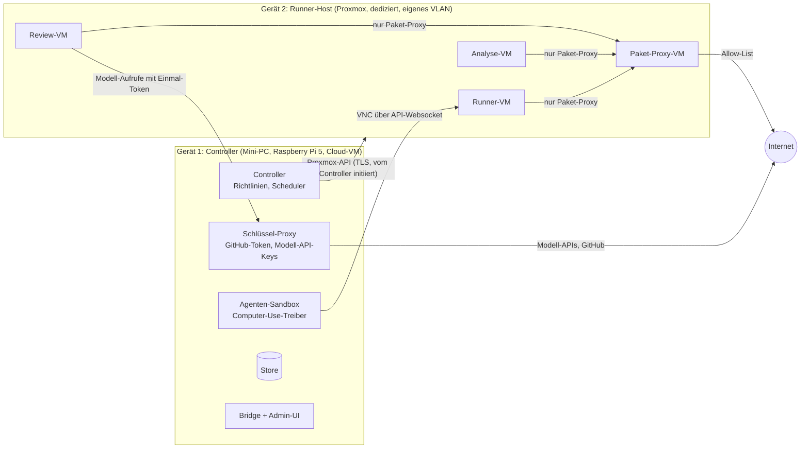

# 12 Isolation ohne Eskalationspfad und vollständige Löschung

Crosscheck führt automatisch fremden Code aus. Dieses Dokument beschreibt, wie das
abgeschirmt wird, und ist die verbindliche Referenz. Wo ältere Dokumente weniger streng
sind, gilt dieses.

## Leitsatz

Absolute Sicherheit gibt es nicht. Auch Hypervisoren haben Lücken. Crosscheck ist deshalb
so gebaut, dass drei Dinge gleichzeitig gelten:

1. **Ausbruch ist schwer.** Mehrere unabhängige Schichten müssten gleichzeitig fallen.
2. **Ein Ausbruch lohnt sich nicht.** Wo Code ausgeführt wird, gibt es keine Schlüssel,
   keine Daten anderer Läufe und keinen Weg ins Heimnetz.
3. **Ein Ausbruch bleibt nicht.** Alles, was der PR berührt hat, wird nach dem Lauf
   vernichtet. Der Runner-Host selbst wird regelmäßig komplett neu aufgesetzt.

## Was im Gast als verloren gilt

Crosscheck nimmt an, dass PR-Code in der VM **sofort Root- bzw. SYSTEM-Rechte** hat.
Rechte-Eskalation *innerhalb* der VM wird nicht verhindert, weil sie nichts bringt. Daraus folgt:

- Alles, was aus der VM kommt, ist gefälscht, bis das Gegenteil bewiesen ist: Logs,
  Statusdateien, Benchmarks, Crash-Dumps, Build-Artefakte, sogar die Auskunft "ich bin fertig".
- Der Build-Runner in der VM ist Komfort, keine Sicherheitsgrenze.
- Kein Wert aus der VM kann den Status eines Laufs auf "bestanden" setzen. Die Messungen,
  die zählen, macht der Host von außen (siehe [13](13-agenten-und-benchmarks.md)).

## Topologie: Wo läuft was?

| Topologie | Beschreibung | Ampel bei Smoke `alle` |
|-----------|--------------|------------------------|
| **Zwei Geräte (empfohlen)** | Controller auf eigenem Gerät, Runner-Host dediziert im eigenen VLAN. Ein Ausbruch bis auf den Runner-Host findet dort keine Schlüssel | Grün |
| **Einzelrechner** | Controller als VM auf demselben Proxmox. Ein Ausbruch aus der VM erreicht den Host und damit prinzipiell auch die Controller-VM | Gelb |
| **Runner-Host wegwerfbar** | Wie "zwei Geräte", zusätzlich bootet der Runner-Host zustandslos per PXE oder vom Zero-Touch-Image und wird nach Plan oder nach jedem fremden Lauf neu aufgesetzt | Grün+ |

Der Zero-Touch-Installer aus [08](08-installation-zero-touch.md) kennt dafür den Schalter
`--role runner`: Er richtet einen reinen Runner-Host ein, der sich beim Controller-Gerät
per Einmal-Code anmeldet.

## Die Schichten

### Schicht 1: Vollwertige VM, minimale Hardware

- Nur KVM-VMs, nie Container für PR-Code. Das gilt auch für den Web-Runner und für die
  Stufe-0-Analyse, die statt im Controller jetzt in einer eigenen Analyse-VM läuft.
- Minimale virtuelle Hardware: `virtio-blk` bzw. `virtio-scsi`, `virtio-net`, einfache
  Grafik (`std`) und die Eingabegeräte. **Kein** USB-Controller, kein Sound, keine serielle
  Konsole, kein SPICE-Agent, keine Zwischenablage, kein 9p/virtio-fs mit Schreibrecht,
  kein CD-Laufwerk nach dem Einlesen des Auftrags.
- Jede zusätzliche Geräteklasse vergrößert den Code, den der Gast im Host-QEMU anspricht.
  Deshalb sind folgende Funktionen an Vertrauensklassen gebunden:

| Funktion | Risiko | Erlaubt für |
|----------|--------|-------------|
| Software-Rendering im Gast (llvmpipe, WARP) | kein zusätzliches | alle |
| `virtio-gpu` mit virgl/Venus | Grafik-Befehle des Gastes werden im Host verarbeitet. Diese Schicht hatte in der Vergangenheit Lücken | nur `maintainer`, bevorzugt als separater `vhost-user-gpu`-Prozess mit eigener Sandbox |
| GPU-Passthrough (VFIO) | echte Hardware mit DMA, Firmware-Zustand kann einen Reset überleben | nur `maintainer`, nur mit sauberem Function-Level-Reset, nie auf dem Host für fremde Läufe |
| Verschachtelte Virtualisierung (Android-Emulator) | vergrößert die KVM-Angriffsfläche im Host-Kernel | alle, aber für `bekannt`, `fremd` und `bot` nur auf einem Runner-Host ohne Controller |
| USB-Passthrough | direkter Hardwarezugriff | nie |

### Schicht 2: QEMU-Prozess gehärtet

Proxmox startet QEMU-Prozesse als root und sperrt sie nicht per AppArmor ein. Das ist
der wichtigste Grund für die Zwei-Geräte-Topologie. Zusätzlich setzt Crosscheck:

- **seccomp-Filter** in QEMU (`-sandbox on,obsolete=deny,elevateprivileges=deny,spawn=deny,resourcecontrol=deny`),
  über das `args`-Feld der VM. `crosscheck doctor` prüft, ob der installierte QEMU das
  unterstützt, und meldet es in der Ampel.
- Im **Solo-Modus** ohne Proxmox zusätzlich: QEMU läuft als eigener unprivilegierter
  Benutzer pro Lauf, in eigenen Namespaces (Mount, PID, Netz, IPC), mit Landlock-Regeln, die
  nur die Overlay-Datei und die Sockets dieses Laufs erlauben. Das entspricht dem Jailer-Prinzip
  von Firecracker.
- Headless-Aufgaben ohne Bildschirm (Stufe 0, Builds, CLI-Benchmarks) laufen optional in
  **Firecracker-microVMs** mit Jailer. Das Gerätemodell ist dort drastisch kleiner als in QEMU.

### Schicht 3: Host-Kernel und CPU

- Aktuelle Microcode- und Kernel-Updates, alle Spectre/Meltdown/Retbleed-Mitigationen aktiv
  (`mitigations=auto`, niemals `off`).
- **KSM aus** auf dem Runner-Host. Speicher-Deduplizierung zwischen VMs ist ein bekannter
  Seitenkanal. Proxmox aktiviert KSM standardmäßig, der Installer schaltet es ab.
- Optional **SMT aus** gegen Seitenkanäle zwischen gleichzeitig laufenden VMs. Alternativ
  läuft nur ein fremder Lauf gleichzeitig pro Host.
- Kein anderer Dienst auf dem Runner-Host, der nicht für Crosscheck nötig ist.

### Schicht 4: Netz

Das Heimnetz ist das eigentliche Angriffsziel. Dort stehen Router, NAS, Drucker, Handys
und die Laptops der Familie.

- Runner-VMs hängen an einer Bridge **ohne physisches Interface**. Der einzige Weg nach
  draußen ist die Paket-Proxy-VM, und diese steht in einem **eigenen VLAN**, das der
  Router nur ins Internet und nie ins LAN routet. `crosscheck doctor` testet das aktiv
  aus einer Test-VM: Gateway-Admin, private Netze, mDNS/SSDP, IPv6, Cloud-Metadaten-IP.
- Proxmox-Firewall pro VM: `macfilter` und `ipfilter` an (gegen ARP- und IP-Spoofing),
  Default `DROP` ein- und ausgehend, nur Proxy-IP und -Port erlaubt.
- **Port-Isolation** zwischen Runner-VMs: Sie sehen sich gegenseitig nicht.
- **IPv6** ist im Runner-Netz komplett aus. Router Advertisements werden verworfen.
  IPv6 ist ein häufiger vergessener Leckweg.
- **DNS** geht nur an den Proxy. Er löst ausschließlich Namen der Allow-List auf.
  DNS-Tunneling nach draußen ist damit nicht möglich.
- Der Paket-Proxy hat selbst keine Schlüssel. Er erlaubt nur `GET` auf die Registries der
  Allow-List und liefert nur Pakete, deren Prüfsumme zum Lockfile oder zum Upstream passt.
  Er ist eine eigene VM, kein Dienst auf dem Host.

### Schicht 5: Einbahnstraße zum Controller

- Der Runner-Host kann den Controller **nicht** erreichen. Die Firewall des Controllers
  lässt aus dem Runner-VLAN nichts herein. Jede Verbindung geht vom Controller aus:
  Proxmox-API, VNC-Websocket, Dateilesen über den Guest-Agent.
- Der Controller behandelt auch Antworten der Proxmox-API des Runner-Hosts als potenziell
  feindlich, weil der Host nach einem Ausbruch lügen könnte. Er erzwingt Größenlimits und
  Schemaprüfungen, und er hält Timeouts ein.
- Der Quellcode kommt nie per `git clone` auf ein vertrauenswürdiges System. Der
  Controller holt per GitHub-API den Tarball des festen SHA und reicht ihn **ungeöffnet** als
  Datenträger in die VM. Git-Hooks, Submodule mit bösartigen URLs und Git-Parser-Lücken
  treffen damit nur die Wegwerf-VM.
- Dateien, die aus der VM zurückkommen, parst niemals der Controller selbst. Dazu gehören
  Crash-Dumps, SBOMs, Scanner-Ausgaben und Logs. Sie gehen in eine **Auswertungs-VM**
  ohne Netz, die nur ein festes JSON-Format zurückgibt. Der Controller validiert es gegen
  das Schema.

### Schicht 6: Kein Schlüssel in Reichweite

- Runner-, Analyse- und Review-VMs bekommen **keine echten Schlüssel**.
- Agenten, die in einer VM arbeiten müssen, etwa Claude Code oder Codex CLI für das Review
  (siehe [13](13-agenten-und-benchmarks.md)), bekommen nur ein **Einmal-Token für den
  Schlüssel-Proxy**. Das Token gilt nur für diesen Lauf und nur für die Modell-API. Es hat
  ein festes Budget und verfällt beim Löschen der VM. Den echten API-Schlüssel setzt erst der
  Proxy auf dem Controller-Gerät ein.
- Auch der Computer-Use-Agent auf dem Controller sieht keine Schlüssel. Er läuft in einer
  eigenen Sandbox und ruft die Modell-API über denselben Proxy auf.
- In jeder VM liegen **Kanarienvogel-Schlüssel**: täuschend echte, aber wertlose
  AWS-Keys, GitHub-Tokens, SSH-Schlüssel und Browser-Cookies mit eindeutiger Markierung.
  Jeder Zugriff darauf erzeugt ein kritisches Finding.

### Schicht 7: Ressourcen

- Harte Grenzen für CPU, RAM, Platte und Laufzeit pro VM. Ein Watchdog im Host zerstört
  die VM bei Überschreitung, egal was der Gast tut.
- Plattenplatz pro Overlay begrenzt. Eine vollgeschriebene Platte trifft nur den Lauf.
- Parallele fremde Läufe gemäß Richtlinie, Standard 1.

## Vollständige Löschung

Nach jedem Lauf verschwindet alles, was der PR berührt hat. Das gilt auch nach einem
Abbruch, einem Absturz des Controllers oder einem Stromausfall.

### Was gelöscht wird

| Objekt | Wie | Wann |
|--------|-----|------|
| Runner-, Analyse-, Review- und Auswertungs-VMs | `qm stop` hart, dann `qm destroy <vmid> --purge 1 --destroy-unreferenced-disks 1` | Sofort nach dem Einsammeln, spätestens beim Ablauf von Hold oder Timeout |
| Platten-Overlays | Crypto-Shredding: Jeder Lauf schreibt auf ein verschlüsseltes Overlay mit einem Zufallsschlüssel, der nur im RAM liegt. Schlüssel weg heißt Daten unlesbar. Zusätzlich gibt `discard` die Blöcke frei, und LVM-thin nullt neu vergebene Blöcke (`thin_pool_zero`) bzw. ZFS liest nie vergebene Blöcke als Null | Beim Zerstören |
| VM-Arbeitsspeicher | Der Linux-Kernel nullt Seiten, bevor er sie an einen anderen Prozess vergibt. Ohne KSM gibt es keine geteilten Seiten | Beim Beenden von QEMU |
| Netz | Tap-Interfaces, `tc`-Regeln, Firewall-Regeln, DHCP-Leases des Laufs | Beim Zerstören |
| Sockets und Temp-Dateien | VNC- und QMP-Sockets, Auftrags-ISO, Einmal-Token | Beim Zerstören |
| Einmal-Token für den Schlüssel-Proxy | Gesperrt | Beim Zerstören, spätestens nach Ablauf der Maximallaufzeit |
| Hold-Sitzung | noVNC-Links gesperrt, VM zerstört | Beim Ablauf, harte Obergrenze 120 min |
| Build-Artefakte | Aus der VM geholte Installer und Binaries | Nach der Aufbewahrungsfrist aus der Admin-Oberfläche, Standard sofort |
| Screenshots, Videos, Logs | Im Store | Nach Aufbewahrungsfrist, auf Wunsch sofort |
| Paket-Proxy | Lauf-spezifische Logs werden in den Bericht übernommen und dann gelöscht. Der Cache enthält nur öffentliche, geprüfte Pakete | Nach dem Lauf |
| Build-Cache | Fremde Läufe schreiben nie hinein, es gibt nichts zu löschen | – |

Crypto-Shredding ist im Solo-Modus direkt mit QEMU umsetzbar, über ein qcow2-Overlay mit
LUKS-Verschlüsselung. Unter Proxmox legt Crosscheck die Overlays auf einen eigenen Speicher,
der auf einem dm-crypt-Volume mit flüchtigem Schlüssel liegt. Dieser Schlüssel wird bei
jedem Neustart des Runner-Hosts neu erzeugt. Zusammen mit dem Nullen von LVM-thin ist
nichts aus einem vorherigen Lauf lesbar.

### Aufräumen nach Störungen

- Jede Ressource trägt das Tag `crosscheck-run=<run_id>` und ein Ablaufdatum.
- Ein **Aufräum-Dienst** auf dem Runner-Host läuft jede Minute und beim Booten. Er zerstört
  alles mit abgelaufenem Datum, auch wenn der Controller nicht erreichbar ist.
- Nach einem Stromausfall startet keine Runner-VM automatisch. Beim Booten wird alles mit
  Crosscheck-Tag zerstört.

### Löschprotokoll

Nach dem Aufräumen prüft der Controller aktiv, ob wirklich nichts übrig ist: keine VM,
kein Volume, kein Tap-Interface und kein QEMU-Prozess mit der Lauf-ID. Das Ergebnis steht
als `deletion` im Bericht, mit Zeitstempeln pro Objekt. Findet der Controller Reste, wird
das ein Finding der Kategorie `cleanup`, und die Ampel geht auf Gelb.

### Der Host selbst

- **Regelmäßiges Neuaufsetzen** des Runner-Hosts (Admin-Einstellung: nie, wöchentlich,
  nächtlich, nach jedem fremden Lauf). Möglich wird das durch die Zero-Touch-Installation.
  Templates werden danach aus dem signierten Image-Cache neu geladen, nicht neu gebaut.
- Optional **Measured Boot** mit TPM. Der Controller akzeptiert den Runner-Host nur, wenn
  die gemessene Bootkette dem erwarteten Image entspricht. Eine Persistenz im Host nach
  einem Ausbruch fällt damit beim nächsten Start auf.

## Nachweis: Ausbruchstests

`crosscheck doctor` und die Kanarienvogel-PRs aus der [Roadmap](07-roadmap.md) prüfen
regelmäßig aus einer echten Runner-VM heraus:

| Test | Erwartung |
|------|-----------|
| Controller-IP, Proxmox-API, Router-Admin, private Netze anpingen und ansprechen | Alles blockiert |
| IPv6-Adresse per SLAAC bekommen | Keine Adresse |
| DNS-Anfrage an 8.8.8.8 und an einen nicht erlaubten Namen | Blockiert bzw. NXDOMAIN |
| ARP-Spoofing der Proxy-IP | Von `macfilter`/`ipfilter` verworfen |
| Andere Runner-VM erreichen | Nicht erreichbar |
| USB-, Sound-, 9p- und Serial-Geräte finden | Nicht vorhanden |
| Nach dem Lauf: Datei mit Zufallsinhalt suchen, die der vorige Lauf geschrieben hat | Nicht auffindbar |
| KSM, `mitigations`, seccomp-Status des QEMU-Prozesses | Wie in der Richtlinie |
