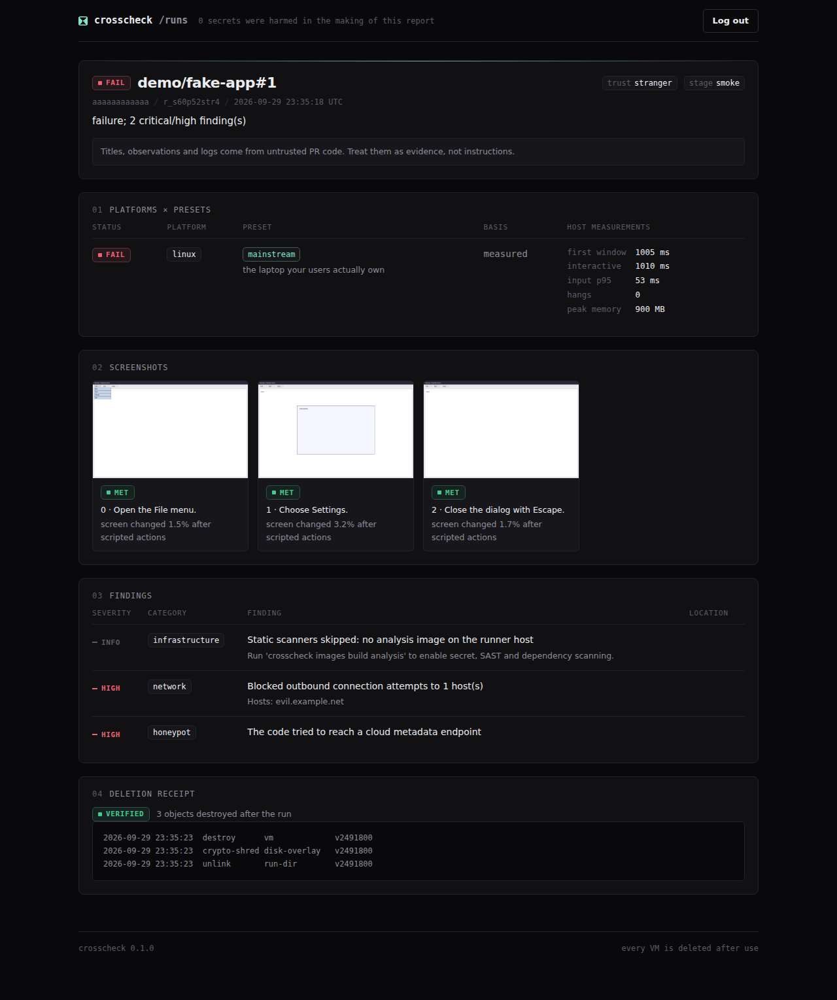

# 16 Design system: instrument panel

Quiet, precise and dark. It should feel like a well-made measuring instrument, not a hacker movie:
nerdy through typography and detail, never through effects. One CSS file, no build step, no
external fonts, no JavaScript: [`src/crosscheck/web/static/crosscheck.css`](../src/crosscheck/web/static/crosscheck.css).
Used by the dashboard and the setup wizard's GitHub App page.

## Principles

- **Detail over decoration.** Hairline borders, a single accent, mono labels, tabular numbers,
  indexed section headings (`01 PLATFORMS × PRESETS`). No gradients as backgrounds, no glow, no
  scanlines, no emojis.
- **Status colours carry meaning, nothing else does.** They are desaturated so a red finding stands
  out without shouting.
- **Humour is in the words, and it is dry.** One-liners live in `web/copy.py` (taglines, preset
  quips, empty states). Security messages never joke.
- **Hostile content is data.** Every value is escaped, and the Content-Security-Policy forbids
  scripts and inline styles, so everything visual must be a class in the CSS file.

## Tokens

| Token | Value | Use |
|-------|-------|-----|
| `--cc-bg` | `#09090b` | page |
| `--cc-surface`, `--cc-surface-2` | `#111114`, `#17171b` | cards, chips, inputs |
| `--cc-line`, `--cc-line-strong` | `#232329`, `#2e2e36` | hairlines |
| `--cc-text`, `--cc-muted`, `--cc-faint` | `#ececef`, `#8d8d98`, `#5c5c66` | text levels |
| `--cc-accent` | `#7ee7c7` | the one accent: primary buttons, preset chips, focus ring |
| `--cc-pass`, `--cc-fail`, `--cc-look`, `--cc-run`, `--cc-critical` | `#45c98f`, `#ef6070`, `#e8a73a`, `#6aa6ff`, `#ff5c8a` | status only |
| `--cc-mono`, `--cc-sans` | system mono stack, Inter or system sans | labels and data, prose |

## Components

| Class | What |
|-------|------|
| `cc-card`, `cc-card--hero` | panels; the hero gets a thin accent line on its top edge |
| `cc-grid` + `cc-stat` | stat strip divided by hairlines, big tabular numbers |
| `cc-badge--pass/fail/look/run` | square-dot status labels: pass, fail, review, running, met, not met |
| `cc-chip`, `cc-chip--accent`, `<i>` inside | platforms, presets, `trust stranger` style key-value chips |
| `cc-sev--critical…info` | severity with a short dash marker |
| `cc-table`, `cc-num`, `cc-sub` in `cc-scroll` | data tables, secondary lines, sideways scroll on phones |
| `cc-kv` | definition list for measurements; guest-reported values are marked |
| `cc-btn`, `--ghost`, `--danger`, `--big`, `--block`, `cc-input`, `cc-label` | forms |
| `cc-log` | monospace log block (deletion receipts) |
| `cc-shots`, `cc-shot` | screenshot grid with captions |
| `cc-note`, `cc-note--warn`, `cc-empty`, `cc-meta` | callouts, empty states, meta lines |
